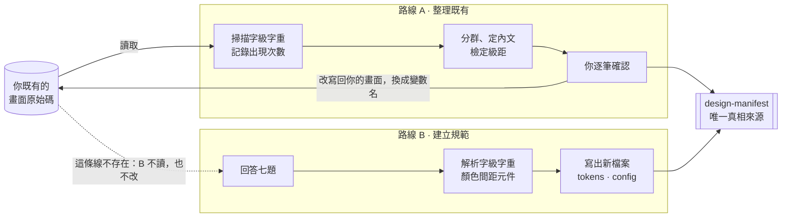

# 使用說明

PM 用白話描述，它在你的專案裡直接產出可以跑的設計規範。兩種用法：從零開始建一套，或
把**已經做好的網站**裡亂掉的字級字重整理成一套。全程不會問你什麼是 Design Token。

---

## 1. 先確認你走哪一條

走錯會白做一輪。

| 你的處境 | 走哪條 | 它會做什麼 |
|---|---|---|
| **網站已經做好了**，但字級大小不知道怎麼調、看起來很亂 | [整理既有](#3-已經有網站把字級字重弄正常) | 掃描你現有的畫面，從裡面推出一套字級表，把離群的數值收回去。**不會問你七題** |
| **新產品要開始**，還沒有規範，也沒有設計師能立刻投入 | [建立規範](#4-從零開始建立一套規範) | 問你七題，產出完整的顏色、字級、間距、元件規範並寫進專案 |



兩條路的差別只有一件事：**A 讀你的畫面，也改回你的畫面；B 兩件都不做。**
所以帶著現成網站走 B，跑完字還是一樣亂。

> [!WARNING]
> **最容易走錯的一步。** 如果你是第一種情境，不要先跑建立規範。建置流程只會產出新規範，
> 它不會去改你既有的畫面——跑完之後你的字還是一樣亂，而且多了一套沒要求過的設定。

**兩種都不適合的情況**：已經有成熟設計系統的專案（會覆寫你的設定）；需要客製視覺語言的
品牌專案；想要它生出完整畫面。

> [!NOTE]
> **先講清楚做不到的。** 它只產出規範，不產出畫面。Screen Generator 和完整的 Design
> Review（顏色、間距、元件）都還在 roadmap 上，做好的只有字級與字重。
>
> 產出的規範**內建小／中／大三段字級**讓使用者自己調（見第 4 節），但那**不等於**完整的
> iOS Dynamic Type / Android 字級可調支援——極大級別下的版面重排還沒有納入。給年齡分布偏高
> 的產品用之前，這件事要先想清楚。

---

## 2. 安裝與啟動

```bash
# A. 當成 plugin（跨專案共用）：clone 下來，在 Claude Code 裡加入為 plugin

# B. 只給單一專案用（最單純）
cp -r product-design-assistant/skills/product-design-assistant \
      你的專案/.claude/skills/
```

裝好之後在你的專案目錄開 Claude Code，用白話說就好。**說法決定它走哪條路**：

```
# 已經有網站，想整理字 → 路線 A
我的網站字級大小不知道怎麼調，幫我整理
字看起來很亂，幫我把字級和字重弄正常

# 從零開始建規範 → 路線 B
幫我的產品建立設計規範
幫我做一套 design starter kit
```

兩種它都會先偵測你的技術棧（Web + Tailwind、React Native，或其他）。

---

## 3. 已經有網站：把字級字重弄正常

六步。你只出現在第 1 步和第 5 步，中間都是它在做。全程不問任何設定題。

**1. 你說一句白話**（見上面的啟動語句）。

**2. 它掃描你的原始碼**，把每一個字級與字重值連同**出現次數**記下來。跳過
`node_modules`、打包產物、以及已經是變數的地方。

**3. 它整理出你現在的樣子**——分群、用最高頻的 14–18px 定出內文、再檢定級距最接近哪個
比例。你會先看到現況，它還沒動任何東西：

```
掃描 42 個檔案，找到 17 種字級、6 種字重

其中 5 種字級佔了 92% 的用量：
  16px ×184  字最多，判定為內文
  14px ×97   說明文字
  20px ×41   小標
  24px ×22   標題
  32px ×8    大標
剩下 12 種各出現 1–3 次，合計 8%  ← 這是亂源

級距檢定：這五級最接近 1.250，平均偏差 0.8px
建議收斂成 6 級，並把那 12 個一次性數值歸位
```

**4. 它逐筆列出要改哪裡**，附上信心程度：

```
src/components/Card.tsx
  L42  22px → 建議 20px（小標）    偏差 2px，幾乎確定是手滑
  L57  15px → 建議 16px（內文）    偏差 1px
  L88  44px → 介於 32 和 48 之間，要往哪邊靠？（需你決定）

src/components/Header.tsx
  L12  font-weight: 550 → 這不是有效字重，瀏覽器會顯示成 500 或 600
```

**5. 你確認之後它才動。** 差 1–2px 的可以「全部套用」；差很多的會一題一題問你，不會替你
猜。改的時候換成**變數名稱**而不是新數字，下次編輯才不會又飄掉。

**6. 它重掃一次並回報收斂結果**——你會看到 17 種變成 6 種。那套字級表會被存下來，之後要做
顏色、間距或完整規範都接在它上面長，不用重來。

> [!NOTE]
> **為什麼是「推導」不是「套用」。** 它不會拿一套現成的字級表來對你的網站。現成的字級表
> 是為「正在設計的產品」校準的，拿去對已經寫好的網站，幾乎每個尺寸都會變成問題，你拿到的
> 會是重寫而不是修正。
>
> 判斷的依據是**出現次數**：用了 184 次的尺寸就是你的內文，用 1 次的才是手滑。你原本的
> 判斷大部分是對的，真正的毛病通常只是那十幾個一次性的數字。

---

## 4. 從零開始：建立一套規範

七步。你出現在第 2 步（回答問題）和第 6 步（看結果）。

1. **它先看你的專案**，判斷技術棧。這決定產出的檔案長什麼樣，所以在問你任何問題之前就會先做。
2. **你回答七題選擇題**，分兩輪問完。
3. **它解析成一份規範**：選 preset、混入你的品牌色、依產品類型開延伸，然後逐項算出字級、
   字重、字距、行高、字體、間距、圓角、元件尺寸，最後跑一次對比驗證。
4. **它把規範寫進你的專案**——CSS 變數、Tailwind 設定，或 React Native 的 theme 檔。既有
   設定只改標記區塊內，不會整份蓋掉。
5. **它產出兩份文件**：給你看的白話說明，和給工程師看的元件寫法。
6. **你看實際畫面。** 能跑的專案它會起 dev server 截圖，空專案會產一份靜態樣式表。它不會
   只跟你說「做好了」。
7. **如果你的專案本來就有畫面**，它會主動問你要不要接著跑第 3 節那個流程——因為剛產出的
   規範**不會自動套用到既有畫面上**。這一步不做，你回頭看網站會覺得什麼都沒變。

### 七題各自決定什麼

全部是選擇題，沒有一題需要你懂設計術語。

| | 題目 | 實際決定什麼 |
|---|---|---|
| Q1 | 產品名稱 | 只是標籤，不影響任何設計決策 |
| Q2 | 產品類型 | 選「金融」會**自動啟用金融延伸**：漲跌色、圖表色、風險等級色，數字改用等寬字型。也會**限制字級級距上限**——資料型產品不讓階梯拉太大，因為那會傷掃描 |
| Q3 | 平台 | 決定用哪個 adapter，也決定行動端兩個上限：**字級級距封在 1.25**、**中文字重封在 600**（iOS 蘋方最重只到中粗體，沒有 700，硬要會變成合成假粗） |
| Q4 | 主要使用者 | 只寫進說明文件，不參與計算 |
| Q5 | 產品給人的感覺 | 三套 preset 之一。決定**字重、字距、行距、字體、顏色、圓角、陰影、留白** |
| Q6 | 品牌主色 | 可以給色票也可以說「深藍色」。它**只換色相**，明暗與飽和度階梯沿用校準好的結構，所以層次關係不會亂掉 |
| Q7 | 資訊密度 | **這題最貴。** 同時決定**留白**和**字級級距**：很多數據要掃描 → 1.200；適中 → 1.250；一次只看少量 → 1.333 |

> [!NOTE]
> **為什麼調性不決定字級。** 字級階梯是資訊設計，不是視覺調性。同一份資料表的重要性排序，
> 不會因為你把調性從「專業穩重」換成「簡約優雅」而改變。所以三個 preset 套在同一個產品上會
> 得到**完全相同的字級**，差異全部落在字重、字距、行距、字體與顏色上。這是刻意的：讓你可以
> 放心改變心意。

### 每套規範都內建小／中／大

不用另外要求，兩條路產出的規範都附一組**使用者可以自己調的字級設定**。預設是「中」。

| | 小 | 中 | 大 |
|---|---|---|---|
| 大標 | 29 | 33 | 37 |
| 標題 | 24 | 28 | 31 |
| 副標 | 20 | 23 | 26 |
| 小標 | 17 | 19 | 22 |
| **內文 / 按鈕** | **14** | **16** | **18** |
| 標籤 / 說明 | 12 | 13 | 15 |
| 金融報價大字 | 35 | 40 | 45 |

三段用**同一個級距換 base 重算**（×0.875 / ×1.0 / ×1.125），不是每一級各乘一個係數——
所以你在 Q5、Q7 選出來的層級關係，三段都成立。

±12.5% 是刻意的。再小就不值得做成設定：會去點它的人要的是**看得出來**的差別，內文差 1px
不是。再大會開始撐破在「中」排好的版面，把無障礙功能變成 bug 單。

**只有字級和行高會變，間距、圓角、按鈕高度都不動。** 間距是另一個軸（Q7 的資訊密度），
一起放大就是整頁縮放，那是瀏覽器 zoom 的事。按鈕高度 40px 三段都裝得下，實測過。

> [!IMPORTANT]
> **這不等於支援無障礙。** 在手機上，這個設定是疊在**系統字級設定之上**，不是 iOS Dynamic
> Type 的實作，也不能替代它。使用者在系統設定裡調大的字，還是會再乘上去。工程師不要為了讓
> app 內的設定說了算而關掉系統縮放——那等於默默退出使用者已經設好的無障礙設定。

---

## 5. 它會產出什麼

```
.design/design-manifest.json    ← 唯一真相來源，所有東西從這裡長出來
.design/design-starter-kit.md   ← 給 PM 看的白話說明
.design/component-guide.md      ← 給工程師看的元件寫法
.design/tokens.css              ← CSS 變數（Web）
tailwind.config.js              ← 只改標記區塊內，不動你原有設定
src/theme/tokens.ts             ← React Native 專案改產這個
```

> [!WARNING]
> **不要手改生成出來的檔案。** 下一次調整時它們會被整個重產，你的手改會消失。要改就改
> manifest，或直接用白話跟它說。

---

## 6. 做完之後怎麼改

直接用白話說。它會對應到最小的改動範圍，不會整套重做。

| 你說 | 它改什麼 | 影響範圍 |
|---|---|---|
| 品牌色改藍色 | 重跑色相混色，重驗對比 | 小 |
| 按鈕圓角改大一點 | 只動 radius | 小 |
| 字太細／標題不夠重 | 只動指定層級的字重 | 小 |
| 字距太擠／太開 | 只動字距表 | 小 |
| 行距太擠／一整片字看不下去 | 只動行高 | 小 |
| 畫面太擠／太鬆 | 動留白密度 | 中 |
| 字體換成 X／公司內網載不到字型 | 重解字體堆疊，重查字重可用性 | 中 |
| **字太大／標題太誇張** | **重解字級級距** | **大——每一頁重排** |

如果你說「太擠」，它會先問你指的是**字太大**還是**畫面太密**——後者便宜得多，而兩者常被
混在同一句話裡。

---

## 7. 給前端的三條規則

產出的 `component-guide.md` 會寫，但這三條最常被漏掉。

### 一、字級四件一組

每個有文字的元素都要同時帶 `text-{層級}`、`font-{層級}`、`tracking-{層級}`、
`leading-{層級}`。單獨用 `text-h1` 會繼承到旁邊元素的字重和行高，那正是規範走鐘的起點。

### 二、一個語意色是五個角色，不是一個值

| 角色 | 門檻 | 用在 |
|---|---|---|
| `fill` | 無 | 純裝飾填色。品牌值，永遠不因對比而改 |
| `graphic` | 3:1 | 圖示、圖表線、輸入框邊框、focus ring |
| `tint` | — | 徽章／chip 底色 |
| `text` | 4.5:1 對**自己的 tint** | 任何當文字用的場合 |
| `action` | bg/fg 4.5:1 | 當填色控制項用，成對取 |

拿到單一的 `--color-error` 就拿去做文字、圖示和按鈕底色，是這個結構要防的事。

### 三、視覺高度 ≠ 點擊區

控制項高度是 32／40／48，用 `height` 寫死，不要用 padding 疊出來。點擊區另外算：web 至少
24×24（WCAG 2.2 SC 2.5.8），iOS 44，Android 48。**不夠的話擴大互動區，不要把控制項變大**
——web 用透明 inset overlay，React Native 用 `hitSlop`。純圖示的按鈕最容易漏，它們沒有文字
撐高度。

---

## 8. 已知限制

- **不產畫面。** Screen Generator 還沒做。
- **內建的小／中／大不等於系統字級支援。** app 內的三段設定會產出，但 iOS Dynamic Type
  與 Android 字級可調的完整整合（包含極大級別下的版面重排）還沒有納入。
- **只稽核字級與字重。** 顏色、間距、元件的稽核都還沒有——路線 A 不會告訴你顏色有問題。
- **中文行高 1.70 沒有權威依據。** W3C 的中文排版需求文件（clreq）有行高章節但沒給數值，
  Material 也沒有中文版本的 token。那是判斷，不是引用——你要推翻它不需要跟任何規範打架。
- **只支援三套 preset。** 它不是自由生成器，是三套校準過的起點加上你的品牌色。
